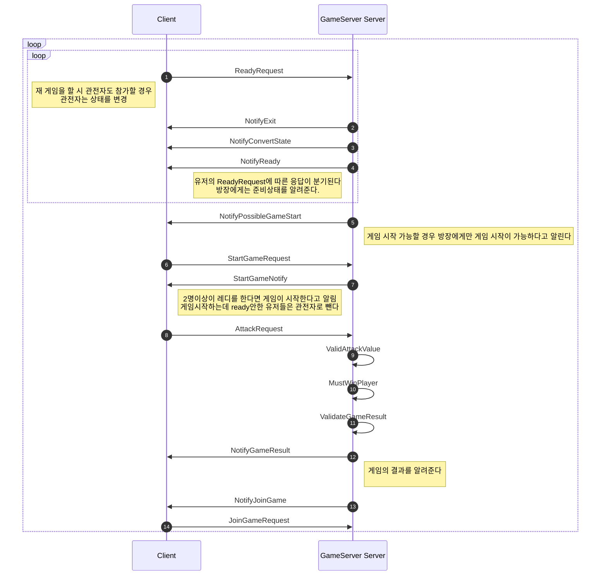

# 게임 진행

```mermaid
sequenceDiagram 
    participant C as Client
    participant GS as GameServer Server
    
    autonumber
loop
    loop
    C ->> GS:  ReadyRequest
    Note left of C: 재 게임을 할 시 관전자도 참가할 경우 <br/> 관전자는 상태를 변경
    GS->>  C:  NotifyExit
    GS->>  C:  NotifyConvertState
    GS->>  C:  NotifyReady
    Note left of GS:  유저의 ReadyRequest에 따른 응답이 분기된다<br/>방장에게는 준비상태를 알려준다.
    end
    GS->> C:   NotifyPossibleGameStart
    Note right of GS: 게임 시작 가능할 경우 방장에게만 게임 시작이 가능하다고 알린다
    C->> GS:   StartGameRequest
    GS->>  C:  StartGameNotify
    Note left of GS: 2명이상이 레디를 한다면 게임이 시작한다고 알림 <br/> 게임시작하는데 ready안한 유저들은 관전자로 뺀다
    C->>  GS:  AttackRequest
    GS ->>GS:  ValidAttackValue
    GS->> GS:  MustWinPlayer
    GS->> GS:  ValidateGameResult
    GS->>  C:  NotifyGameResult
    Note right of GS: 게임의 결과를 알려준다 <br/> 
    GS->>  C:  NotifyJoinGame
    C->>  GS:  JoinGameRequest
    end  
```